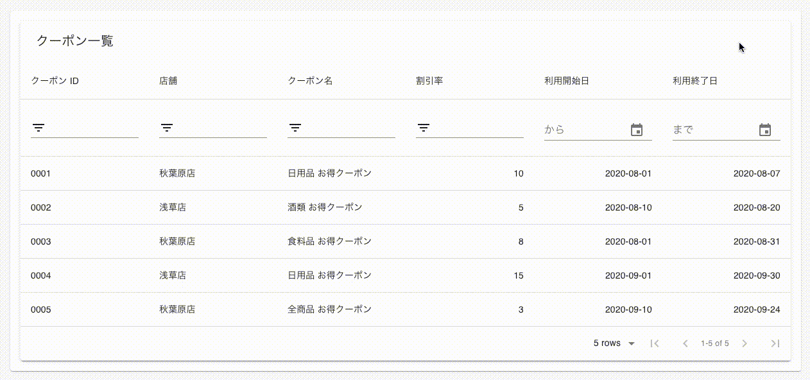

# material-table-filter-by-date-range

[material-table](https://material-table.com/#/) で日付範囲指定によるフィルタリングを実現します。

## Demo



## Environment

```
$ sw_vers
ProductName:	Mac OS X
ProductVersion:	10.14.6
BuildVersion:	18G103

$ node --version
v12.12.0

$ npm --version
6.11.3

$ yarn --version
1.19.1

$ yarn global list
info "create-react-app@3.4.0" has binaries:
   - create-react-app
   ...
```

## Usage

```
$ yarn install
$ yarn start
```
